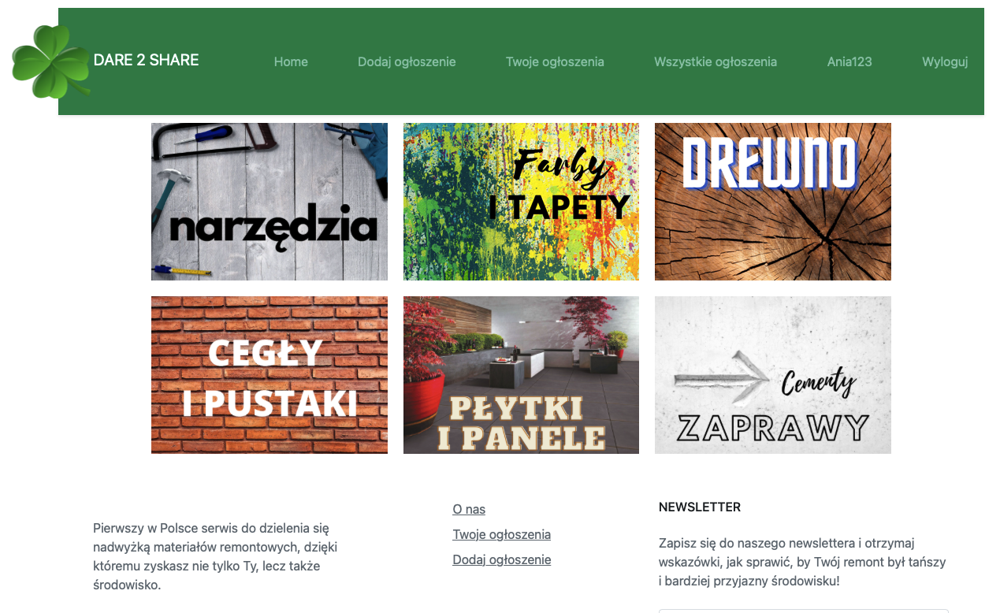
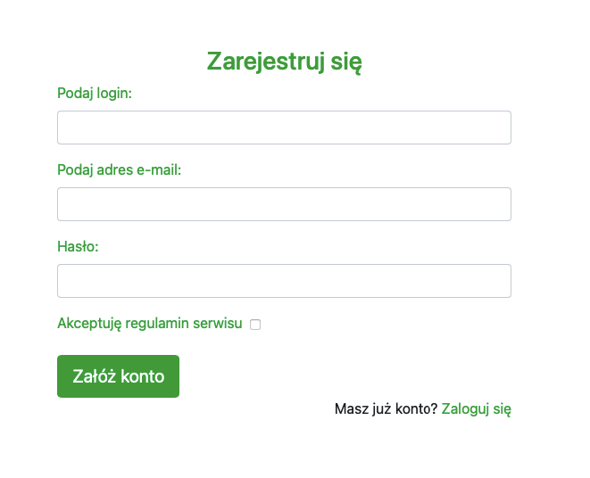
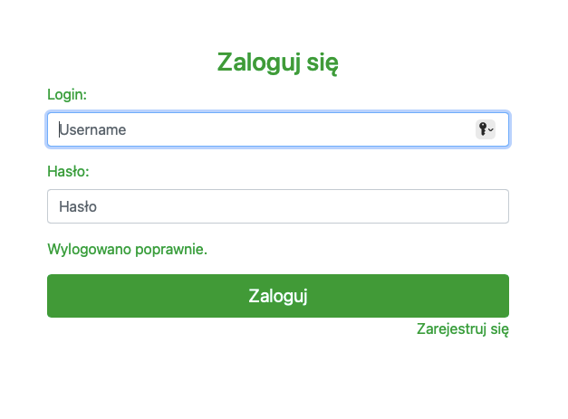

## Table of contents
* [General info](#general-info)
* [Technologies](#technologies)
* [Pictures](#pictures)

## General info
"Dare 2 share" is the advertisement platform for sharing redecorating materials and tools. It is based on zero waste approach. The project is written in Spring Boot and uses MySQL (includes 3 tables and 2 relations between them). It contains 3 forms (sent to the server with post method). Front-end bases on Bootstrap and communicates with back-end via Thymeleaf technology. 

## Technologies
* Java ver. 11
* Spring Boot ver. 2.6.13
* Spring Security
* Spring Data
* Bootstrap ver. 4
* Thymeleaf
* MySQL

## Pictures

